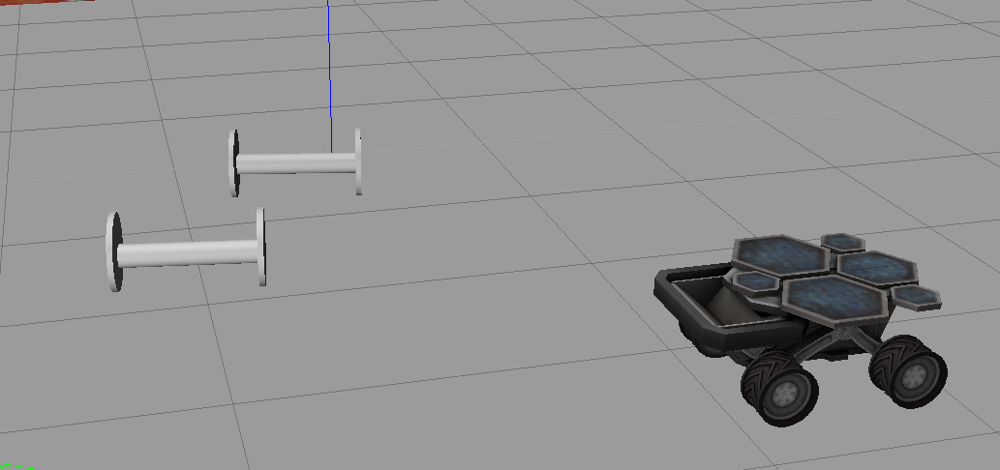

# Project 1: Build My World

 
 


## Structure
```
.
└── 1-build-my-world              
    ├── build.sh                 # Build Script - Step 1
    ├── CMakeLists.txt
    ├── model                    # Model files 
    │   ├── area98
    │   └── car99
    ├── README.md
    ├── run.sh                    # Run Script - Step 2
    ├── script                    # Plugin files 
    │   └── hello.cpp
    └── world                     # World files
        └── my.world
```

## Build Instructions
1. Make sure you have the following installed:
   - [ROS](http://wiki.ros.org/ROS/Installation)
   - Cmake
   - gcc/g++
   - Git
2. Clone the project
3. Go to the project folder
4. Create a build folder `mkdir build && cd build`
5. Build with cmake `cmake .. && make`
6. Add the build folder to the Gazebo plugin path: 
`GAZEBO_PLUGIN_PATH=${GAZEBO_PLUGIN_PATH}:<path_to_build_folder>`. 
7. Go back to the project folder
8. Launch Gazebo world `gazebo world/my.world`

### Alternate steps
1. `source build.sh` -> script builds the prodject like above.
2. Launch the world by using `source run.sh` script.
