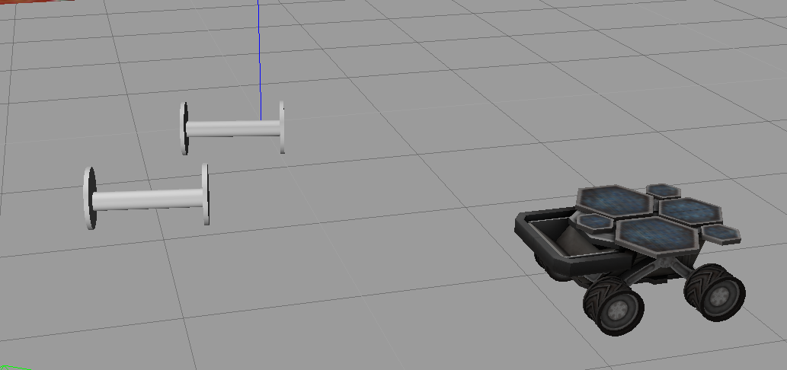
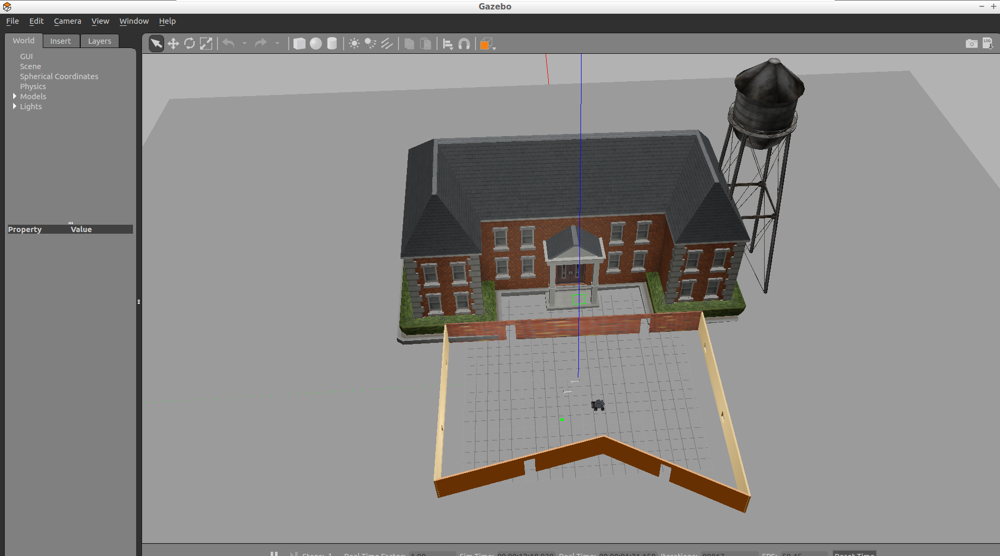

# Project 1: Build My World

 
 


## Structure

Change the directory to project - `cd  1-build-my-world`

```
.
└── 1-build-my-world              
    ├── build.sh                 # Build Script - Step 1
    ├── CMakeLists.txt
    ├── model                    # Model files 
    │   ├── area98
    │   └── car99
    ├── README.md
    ├── run.sh                    # Run Script - Step 2
    ├── script                    # Plugin files 
    │   └── hello.cpp
    └── world                     # World files
        └── my.world
```

## Build Instructions
1. Make sure you have the following installed:
   - [ROS](http://wiki.ros.org/ROS/Installation)
   - Cmake
   - gcc/g++
   - Git
2. Clone the project
3. Go to the project folder
4. Create a build folder `mkdir build && cd build`
5. Build with cmake `cmake .. && make`
6. Add the build folder to the Gazebo plugin path: 
`GAZEBO_PLUGIN_PATH=${GAZEBO_PLUGIN_PATH}:<path_to_build_folder>`. 
7. Go back to the project folder
8. Launch Gazebo world `gazebo world/my.world`

### Alternate steps
1. `source build.sh` -> script builds the prodject like above.
2. Launch the world by using `source run.sh` script.


# Project 2: Go Chase It

Use ROS and Gazebo to build a mobile robot for chasing a white ball.

<a href="https://www.youtube.com/watch?v=fugrDDqZiU8&" target="_blank">
</a>

## Structure


**my_robot**: This package defines the world and the robot.

**ball_chaser**: This package contains two ROS nodes for commanding the robot to chase the white ball.


```
	robond@udacity:~/robotics-nanodegree-ws/2-go-chase-robot/src$ tree 
	.
	├── ball_chaser
	│   ├── CMakeLists.txt
	│   ├── include
	│   │   └── ball_chaser
	│   ├── launch
	│   │   └── ball_chaser.launch
	│   ├── my_ball
	│   │   ├── model.config
	│   │   └── model.sdf
	│   ├── package.xml
	│   ├── src
	│   │   ├── drive_bot.cpp
	│   │   └── process_image.cpp
	│   └── srv
	│       └── DriveToTarget.srv
	├── CMakeLists.txt -> /opt/ros/kinetic/share/catkin/cmake/toplevel.cmake
	├── my_robot
	│   ├── CMakeLists.txt
	│   ├── launch
	│   │   ├── robot_description.launch
	│   │   └── world.launch
	│   ├── meshes
	│   │   └── hokuyo.dae
	│   ├── package.xml
	│   ├── urdf
	│   │   ├── my_robot.gazebo
	│   │   └── my_robot.xacro
	│   └── worlds
	│       ├── aytest2.world
	│       ├── aytest.world
	│       ├── cafe.world
	│       ├── empty.world
	│       ├── my.world
	│       └── test.world
	└── simple_arm
	    ├── CMakeLists.txt
	    ├── config
	    │   └── controllers.yaml
	    ├── images
	    │   └── simulation.png
	    ├── launch
	    │   ├── robot_control.xml
	    │   ├── robot_description.xml
	    │   └── robot_spawn.launch
	    ├── LICENSE
	    ├── meshes
	    │   └── camera.dae
	    ├── package.xml
	    ├── README.md
	    ├── src
	    │   ├── arm_mover.cpp
	    │   ├── look_away.cpp
	    │   └── simple_mover.cpp
	    ├── srv
	    │   └── GoToPosition.srv
	    ├── urdf
	    │   ├── simple_arm.gazebo.xacro
	    │   └── simple_arm.urdf.xacro
	    └── worlds
		└── willow_garage.world
```

## Build Instructions
1. Make sure you have the following installed:
   - [ROS](http://wiki.ros.org/ROS/Installation)
   - Cmake
   - gcc/g++
   - Git
2. Clone the project
3. Go to the project folder
4. Move back to `catkin_ws\` and build
```
$ cd ..
$ catkin_make
```
5. Launch the world
```
$ source devel/setup.bash
$ roslaunch my_robot world.launch
```
6. Open another terminal (Ctrl+Shift+T), and launch the `ball_chaser` package
```
$ source devel/setup.bash
$ roslaunch ball_chaser ball_chaser.launch
```
7. Pick up the white ball and place in front of the mobile robot. The robot will follow the ball.
